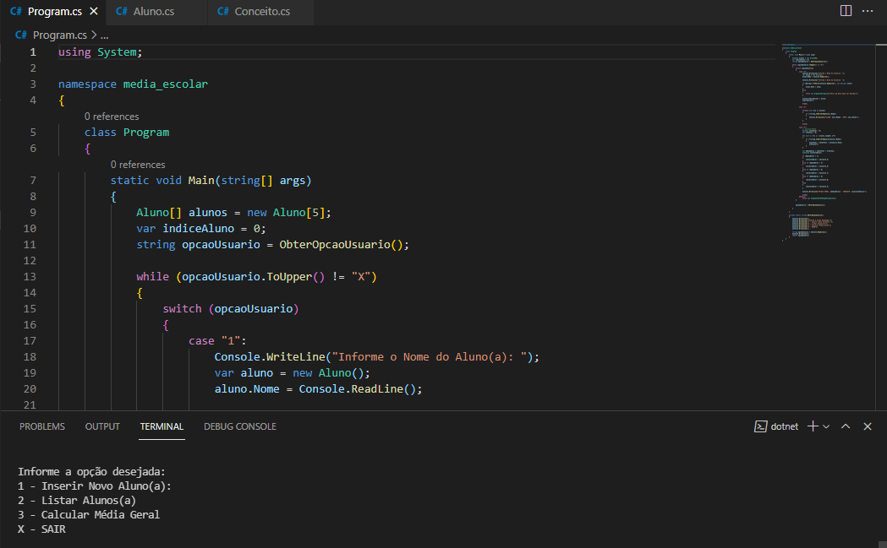

 

  

 
 ## 🚀 Tecnologias

- C# 
- .NET (framework)

## 💻 Projeto

Algoritimo de Média Escolar, foi desenvolvido em linguagem em C# + .NET , foi apresentado e projetado pelo professor Gabriel Faraday no curso de "Primeiros passos .NET + C#" na plataforma da DIO (Digital Innovation One).

Neste projeto, o algoritimo coleta os nomes dos alunos e suas notas, e logo após, apresenta a opção de calcular a média geral de todos alunos da suposta escola, e também sua classificação geral (A, B, C, D, E).

 
## 📝 Aprendizado - Anderson Nascimento

 Foi meu primeiro contato com a linguagem C# e o framework .NET , muito boa a experiência. 

 Em breve teremos mais práticas! 😀

 

 ## 📝 Como Executar ??

 1)Baixar e instalar a biblioteca .NET SDK (caso ja possua, ignore)

 2)Acessar o diretório "media escolar', utilizando o Visual Studio ou PowerShell e executar o comando:

 * dotnet run

 ============================================================ 
